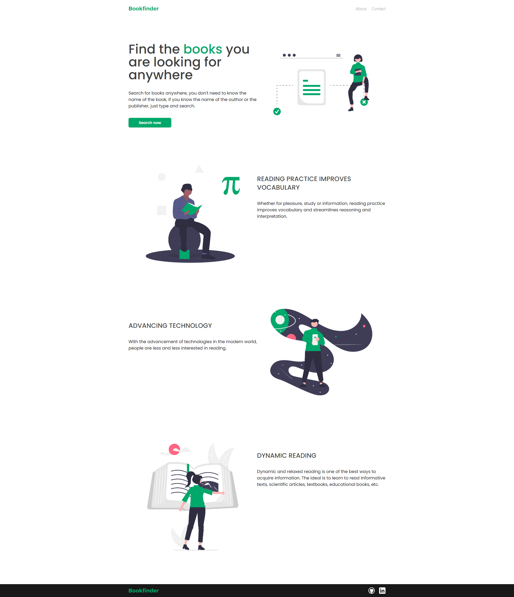
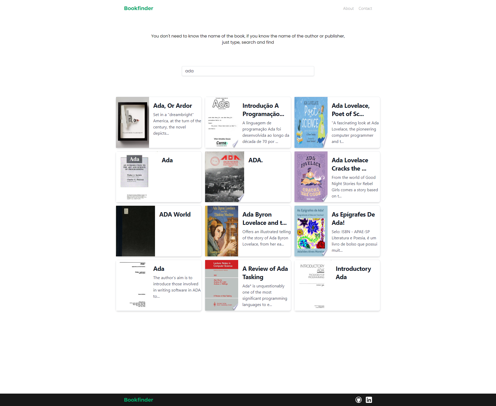

 

  

  <h3 align="center">Bookfinder</h3>

  

   An application that will allow users to search for books by entering a query (Title, Author, etc). Display the resulting books in a list on the page with all the corresponding data.
     
  

### Built With

This project was done in tailwind, vue and vuex. Hosted at Vercel

 

      
      
   
 

   
##
## Projects Images
### Home

### Books

